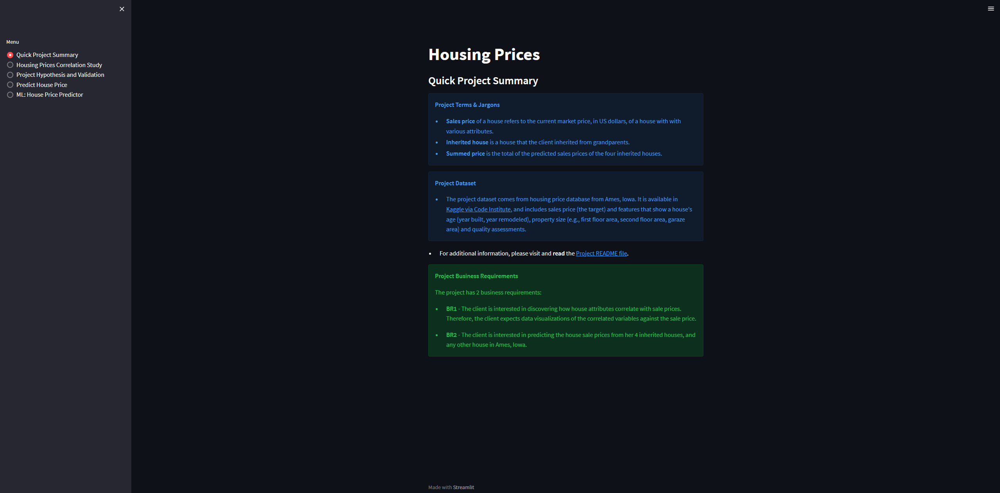
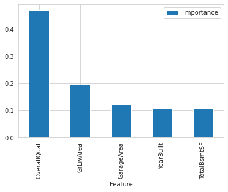
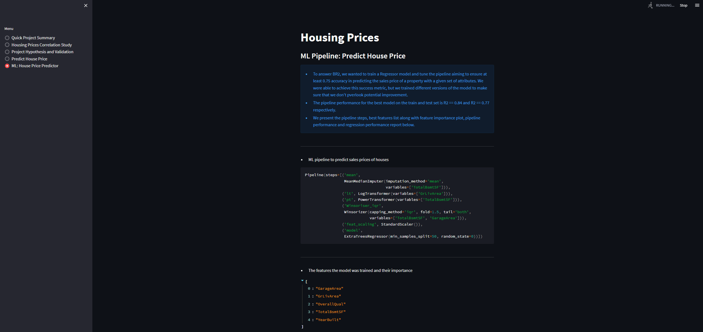

# **House Price Predictor**

This project is a machine learning-based web application that predicts house prices in Ames, Iowa based on a dataset of housing features like size, quality, and location.

The dashboard for [House Price Predictor is hosted on Heroku](https://house-price-predictor-iowa-80ac19b0f501.herokuapp.com/).

## Table of Contents

1. [Dataset Content](#1-dataset-content)
2. [Business Requirements](#2-business-requirements)
    - [Epics](#epics)
    - [User Stories](#user-stories)
3. [Hypotheses and validation](#3-hypotheses-and-validation)
4. [Rationale to map the business requirements to the Data Visualizations and ML tasks](#4-rationale-to-map-the-business-requirements-to-the-data-visualizations-and-ml-tasks)
5. [ML Business Case](#5-ml-business-case)
6. [Dashboard Design](#6-dashboard-design)
   - [Page 1: Quick project summary](#page-1-quick-project-summary)
   - [Page 2: House prices Correlation Study](#page-2-house-prices-correlation-study)
   - [Page 3: Project hypotheses and validation](#3-hypotheses-and-validation)
   - [Page 4: Predict House price](#page-4-predict-house-price)
   - [Page 5: ML: House Price Predictor](#page-5-ml-house-price-predictor)
7. [Unfixed Bugs](#7-unfixed-bugs)
8. [Deployment](#8-deployment)
9. [Main Data Analysis and Machine Learning Libraries](#9-main-data-analysis-and-machine-learning-libraries)
10. [Credits](#10-credits)

## **1. Dataset Content**

* The dataset for this project is obtained from [Kaggle](https://www.kaggle.com/codeinstitute/housing-prices-data). We fabricated a user story where predictive analytics can be applied in a real project in the workplace. 

* The dataset has almost 1.5 thousand rows and represents housing records from Ames, Iowa. The dataset has 22 features indicating house profile (Floor Area, Basement, Garage, Kitchen, Lot, Porch, Wood Deck, Year Built) and its respective sale price for houses built between 1872 and 2010.

The table below shows the variables, their description and units of measurement. We note that some variables are numerical while others are categorical.

|Variable|Meaning|Units|
|:----|:----|:----|
|1stFlrSF|First Floor square feet|334 - 4692|
|2ndFlrSF|Second floor square feet|0 - 2065|
|BedroomAbvGr|Bedrooms above grade (does NOT include basement bedrooms)|0 - 8|
|BsmtExposure|Refers to walkout or garden level walls|Gd: Good Exposure; Av: Average Exposure; Mn: Mimimum Exposure; No: No Exposure; None: No Basement|
|BsmtFinType1|Rating of basement finished area|GLQ: Good Living Quarters; ALQ: Average Living Quarters; BLQ: Below Average Living Quarters; Rec: Average Rec Room; LwQ: Low Quality; Unf: Unfinshed; None: No Basement|
|BsmtFinSF1|Type 1 finished square feet|0 - 5644|
|BsmtUnfSF|Unfinished square feet of basement area|0 - 2336|
|TotalBsmtSF|Total square feet of basement area|0 - 6110|
|GarageArea|Size of garage in square feet|0 - 1418|
|GarageFinish|Interior finish of the garage|Fin: Finished; RFn: Rough Finished; Unf: Unfinished; None: No Garage|
|GarageYrBlt|Year garage was built|1900 - 2010|
|GrLivArea|Above grade (ground) living area square feet|334 - 5642|
|KitchenQual|Kitchen quality|Ex: Excellent; Gd: Good; TA: Typical/Average; Fa: Fair; Po: Poor|
|LotArea| Lot size in square feet|1300 - 215245|
|LotFrontage| Linear feet of street connected to property|21 - 313|
|MasVnrArea|Masonry veneer area in square feet|0 - 1600|
|EnclosedPorch|Enclosed porch area in square feet|0 - 286|
|OpenPorchSF|Open porch area in square feet|0 - 547|
|OverallCond|Rates the overall condition of the house|10: Very Excellent; 9: Excellent; 8: Very Good; 7: Good; 6: Above Average; 5: Average; 4: Below Average; 3: Fair; 2: Poor; 1: Very Poor|
|OverallQual|Rates the overall material and finish of the house|10: Very Excellent; 9: Excellent; 8: Very Good; 7: Good; 6: Above Average; 5: Average; 4: Below Average; 3: Fair; 2: Poor; 1: Very Poor|
|WoodDeckSF|Wood deck area in square feet|0 - 736|
|YearBuilt|Original construction date|1872 - 2010|
|YearRemodAdd|Remodel date (same as construction date if no remodeling or additions)|1950 - 2010|
|SalePrice|Sale Price|34900 - 755000|
#


### **Project Terms and Jargon**

* **Sale price** of a house refers to the current market price of a house with certain attributes.

* **Inherited house** is a house that the client inherited from their grandparents.

* **Summed price** is the total of the sale prices of the four inherited houses.

## **2. Business Requirements**
Our client, who received an inheritance from a deceased great-grandfather in Ames, Iowa, has asked us to  help in maximizing the sales price for the inherited properties.

Although our client has a good understanding of property prices in her own state and residential area, she is worried that basing her estimates on her current knowledge might lead to inaccurate appraisals. What makes a house desirable and valuable where she comes from might not be the same in Ames, Iowa. 

Our client provided us with a public dataset they found with house prices for Ames, Iowa.

We have agreed with our client on the following business requirements.

* **BR1** - The client is interested in discovering how the house attributes correlate with the sale price. Therefore, the client expects data visualizations of the correlated variables against the sale price to show that.

* **BR2** - The client is interested to predict the house sales price from her 4 inherited houses, and any other house in Ames, Iowa.

In order to address the business requirements, we have the following epics and user stories. Each user story was then broken down to manageable stasks, and the agile process was used to implement each task. 

### Epics

* Information gathering and data collection.

* Data visualization, cleaning, and preparation.

* Model training, optimization and validation.

* Dashboard planning, designing, and development.

* Dashboard deployment and release.

### User Stories

* US1: As a client, I want to identify which house attributes have the strongest correlation with sale price, so I can focus on the most influential features for predictions. (Business Requirement Covered: BR1)

* US2: As a client, I want accurate sale price predictions for the houses I have inherited, so I can maximize the total revenue from their sale. (Business Requirement Covered: BR2)

* US3: As a technical user, I want to understand the machine learning steps used to generate sale price predictions, so I can better comprehend the chosen model. (Business Requirement Covered: BR2)

* US4: As a technical user, I want to evaluate the model's performance, so I can ensure its predictions are reliable. (Business Requirement Covered: BR2)

* US5: As a client, I want a dashboard to display prediction results in a standalone application for easy access and visualization.

* US6: As a user, I want interactive input widgets to enter real-time house data and instantly receive sale price predictions. (Business Requirement Covered: BR2)

* US7: As a user, I want to view relevant plots that illustrate the relationships between sale price and other features, so I can better interpret the data. (Business Requirement Covered: BR1)

* US8: As a user, I want access to a pre-built data cleaning and preparation pipeline, so I can predict sale prices efficiently without starting from scratch.

* US9: As a user, I want to know the source and details of the data used to train the model, so I can trust the quality and reliability of its predictions.

* US10: As a user, I want a clear explanation of the project's hypotheses and their validation process, so I can gain deeper insights into the factors influencing sale price.


## **3. Hypotheses and validation**

1. We hypothesize that larger the property, the higher its sale price will be.

   * We will examine correlations between attributes about the size of the house and the sale price.

2. Ratings of the quality and condition of the house would reflect its value, and thus we suspect that higher quality ratings indicate higher sale price.

   * We will use the correlation between variables about the different ratings of the house such as kitchen quality and overall quality, and the sale price to validate this hypothesis.

3. We expect that the value of a property will be significantly influenced by how old the property is and/or whether it had any remodel added to it recently.

   * We study when the house was built and/or when it had a remodel added and the value of the property to validate this hypothesis.

## **4. Rationale to map the business requirements to the Data Visualizations and ML tasks**

* **Business Requirement 1 (BR1):** Data Visualization and Correlation study

  * We will inspect the sale price of the houses in the data and plot a histogram to understand its distribution.

  * We will study the magnitudes and directions of correlation between the attributes and sale price of the houses. We will compute both Peason and Spearman correlations.

  * We will plot the key variables against the sale price of the houses to illustrate the nature of relationship.

  * The correlation study notebook handles this business requirement.


* **Business Requirement 2 (BR2):** Regression Analysis

  * As the target variable we are interested to predict is continuous, we will use regression analysis to address this business requirement. In case the performance of our regression model is poor, we may change this to a classification problem.

  * Not all attributes will have the same effect on the sale price. We want to identify variables that contribute to the lion's share of the price so that our customer can maximize price by leveraging these factors. We may use PCA to identify these variables.

  * The Modeling and Evaluation - Predict House Prices notebook handles this business requirement.

## **5. ML Business Case**

### **Predict Sale Price**
#### **Regression Model**

* In order to meet the second business requirement (BR2), we trained a Machine Learning model.

* *The aim behind the Machine Learning model* is to enable our client to predict sale price of four inherited houses as well as any house with similar attributes. 

* *The learning method* for the Machine Learning model is a **regression model**, because our target variable is a discrete number. It will be a supervised and uni-dimensional ML task. 

* *The ideal outcome* is to provide our client with reliable insight into house attributes that *help maximize their sale price*.

* *The model success/failure metrics* are
	* At least 0.75 for R2 score, on train and test set
	* The ML model is considered a failure if:
		* for a given house, the model's predictions are off more than 25% of the time.

* The output is defined as a continuous value for sale price in USD. It is assumed that this model will predict sale price of a house whose relevant attributes are known. 
   * *The inherited houses* that our client has provided us *have known attributes*, and we want the model to predict the sale price of each house and the summed sale price for the four inherited houses. 
   * For *live prediction* of sale price of a house other than the four inherited houses, we want to enable the user to enter the required values for the relevant features and get the *predicted sale price* in real-time. *The model output* in the live prediction will not include summed sale price, because the user will enter data for one house at a time.
   * Both the summed sale price and the live prediction *are relevant for our client*, who already has four inherited houses but may also want to predict other similar houses from Ames, Iowa.    

* Heuristics: Our client could have used her understanding of property prices in her own state and residential area, but she fears that basing her estimates for property worth on her current knowledge might lead to inaccurate appraisals. So she requested us to help her maximize sale price. We rely on a Machine Learning model and draw on regression algorithms, instead of using inaccurate heuristics.

* The training data we use to develop out house price predictor (HouPP) model come from a public dataset in Ames, Iowa. This dataset contains about 1.5 thousand property price records and 22 features.

	* Train data: drop variables 'EnclosedPorch' and 'WooddeckSF' because each has more than 75% missing values. 

  * Target variable: SalePrice 

  * Features: all remaining variables.

<details>
<summary> Pipeline steps</summary>

</details>


## **6. Dashboard Design**

### **Page 1: Quick project summary**

This page shows a quick summary of
 
<details>
<summary> The project's key terms and jargon</summary>

* **Sales price** of a house refers to the current market price of a house with certain attributes.
* **Inherrited house** is a house that the client inherited from grandparents.
* **Summed price** was determined by adding the sales prices of the four inherited houses.
</details>
 
<details>
<summary> The project dataset</summary>

* The project dataset comes from housing price database from Ames, Iowa. It is available in [Kaggle via Code Institute](https://www.kaggle.com/codeinstitute/housing-prices-data), and includes sales price (the target) and features that show a house's age (year built, year remodeled), property size (first floor area, second floor area, garaze area) and quality assessments."
        
</details>
 
<details>
<summary> The business requirements</summary>

* The project has 2 business requirements:

   * **BR1** - The client is interested in discovering how house attributes correlate with sale prices.Therefore, the client expects data visualizations of the correlated variables against the sale price.
   
   * **BR2** - The client is interested in predicting the house sale prices from her 4 inherited houses, and any other house in Ames, Iowa.

</details>

<details>
<summary>Page 1: Quick project summary (Screenshot)</summary>

</details>

### **Page 2: House prices Correlation Study (BR1)**

This page shows
* the business requirement that was handled by correlation study.
* a checkbox for inspecting the dataset
* a listing of findings related to which features have the strongest correlation to the house sale price.
* a checkbox for displaying plots of sale price and each of the features that have strong correlation. This section of the page displays:
  * the distribution of the target variable (sale price)
  * regression plots of sale price and each of the continuous numerical features
  * box plots of sale price and each of the categorical features
  * line graphs of sale price and each of the time variables
  * heatmaps showing correlations

<details>
<summary>Pearson Correlation Heatmap</summary>

</details>

<details>
<summary>Spearman Correlation Heatmap</summary>

</details>

<details>
<summary> PPS Heatmap</summary>

</details>

#### Target Analysis

SalePrice is our target variable, and its distribution is studied using histogram. 


After identifying the features most correlated with the target variable, we analyse the relationships between saleprice and each feature. 
- For categorical features, we use box plot
- For features with continuous values, we use catter plot
- For time variables, we use line plot

<details>
<summary>Click here to toggle plots</summary>


</details>

<details>
<summary>Page 2: House prices Correlation Study (Screenshot)</summary>

</details>

### **Page 3: Project hypotheses and validation**

1. **H1 - Size matters.** We hypothesize that larger the property, the higher its sale price will be.

**Correct.** From the correlation study results, we found that features that reflect the size of a property were positively and moderately correlated with sale price.

2. **H2 - Quality matters.** Ratings of the quality and condition of the house would reflect its value, and thus we suspect that higher quality ratings indicate higher sale price.

**Correct.** We used the correlation between sale price and the kitchen quality and overall quality ratings to show that this is indeed the case.

**H3 - Time matters.** We expect that the value of a property will be significantly influenced by how old the property is and/or whether it had any remodel added to it recently.

**Correct.** We validated this hypothesis by studying the correlation between the sale price and the years it was built and/or had a remodel added to it. Both features have moderate positive correlation with sale price.

<details>
<summary>Page 3: Project hypotheses and validation (Screenshot)</summary>

</details>

### **Page 4: Predict House price (BR2)**

* State business requirement 2

  * The client is interested in predicting the house sale prices from her 4 inherited houses, and any other house in Ames, Iowa.

* This page displays the 4 houses' attributes and their respective predicted sale price. 

* It displays a message informing the summed predicted price for all 4 inherited houses. 

* Set of interactive input widgets that allow a user to provide real-time house data to predict the sale price.

* "Predict Sale Price" button that serves the new house data to our ML pipelines, and predicts the sale price of the house.


<details>
<summary>Page 4: Predict House price (Screenshot)</summary>

</details>

### **Page 5: ML: House Price Predictor**

This page presents:

* considerations and conclusions after the pipeline was trained

* the ML pipeline steps

* feature importance (both a list and a plot)

* pipeline performance of the regression model

<details>
<summary>Feature Importance</summary>

</details>

<details>
<summary>Page 5: ML: House Price Predictor (Screenshot)</summary>



</details>

## Technologies Used

The technologies used throughout the development are listed below:

### Languages

* [Python](https://www.python.org/)

### Python Packages

* [Pandas](https://pandas.pydata.org/docs/index.html) - Open source library for data manipulation and analysis.
* [Numpy](https://numpy.org/doc/stable/index.html) - Adds support for large, multi-dimensional arrays and matrices, and high-level mathematical functions.
* [YData Profiling](https://docs.profiling.ydata.ai/latest/) - For data profiling and exploratory data analysis.
* [Matplotlib](https://matplotlib.org/) - Comprehensive library for creating static, animated and interactive visualisations.
* [Seaborn](https://seaborn.pydata.org/) - Another data visualisation library for drawing attractive and informative statistical graphics.
* [Feature-engine](https://feature-engine.trainindata.com/en/latest/) - Library with multiple transformers to engineer and select features for machine learning models.
* [ppscore](https://pypi.org/project/ppscore/) - Library for detecting linear or non-linear relationships between two features.
* [scikit-learn](https://scikit-learn.org/stable/) - Open source machine learning library that features various algorithms for training a ML model.

### Other Technologies

* [Git](https://git-scm.com/) - For version control
* [GitHub](https://github.com/) - Code repository and GitHub projects was used as a Kanban board for Agile development
* [Heroku](https://heroku.com) - For application deployment
* [gitpod](https://gitpod.com/) - IDE used for development

## Testing
### Manual Testing

#### User Story Testing
* Dashboard was manually tested using user stories as a basis for determining success.
* Jupyter notebooks were reliant on consecutive functions being successful so manual testing against user stories was deemed irrelevant.

*As a non-technical user, I can view a project summary that describes the project, dataset and business requirements to understand the project at a glance.*

| Feature | Action | Expected Result | Actual Result |
| --- | --- | --- | --- |
| Project summary page | Viewing summary page | Page is displayed, can move between sections on page | Functions as intended |

---

*As a non-technical user, I can view the project hypotheses and validations to determine what the project was trying to achieve and whether it was successful.*

| Feature | Action | Expected Result | Actual Result |
| --- | --- | --- | --- |
| Project hypotheses page | Navigate to page | Clicking on navbar link in sidebar navigates to correct page | Functions as intended |

---

*As a non-technical user, I can enter unseen data into the model and receive a prediction (Business Requirement 2).*

| Feature | Action | Expected Result | Actual Result |
| --- | --- | --- | --- |
| Prediction page | Navigate to page | Clicking on navbar link in sidebar navigates to correct page | Functions as intended |
| Enter live data | Interact with widgets | All widgets are interactive, respond to user input | Functions as intended |
| Live prediction | Click on 'Predict Sale Price' button | Clicking on button displays message on page with prediction | Functions as intended |

---

*As a technical user, I can view the correlation analysis to see how the outcomes were reached (Business Requirement 1).*

| Feature | Action | Expected Result | Actual Result |
| --- | --- | --- | --- |
| Correlation Study page | Navigate to page | Clicking on navbar link in sidebar navigates to correct page | Functions as intended |
| Correlation data | Tick inspect housing data checkbox | Correlation data is displayed on dashboard | Functions as intended |
| PPS Heatmap | Tick PPS heatmap checkbox | Heatmap is displayed on dashboard | Functions as intended |
| Feature Correlation | Select feature from dropdown box | Relevant countplot is displayed | Functions as intended |

---

*As a technical user, I can view all the data to understand the model performance and see statistics related to the model (Business Requirement 2)*

| Feature | Action | Expected Result | Actual Result |
| --- | --- | --- | --- |
| ML House Price Predictor | Navigate to page | Clicking on navbar link in sidebar navigates to correct page | Functions as intended |
| ML Pipelines | View page | Both ML Pipelines from Jupyter notebooks are displayed | Functions as intended |
| Feature Importance | View page | Most important features are plotted and displayed | Functions as intended |
| Model Performance | View page | Confusion matrix for train and test sets are displayed | Functions as intended |

### Validation
All code in the app_pages and src directories was validated as conforming to PEP8 standards using CodeInstitute's PEP8 Linter.
* Some files had warnings due to 'line too long', however these were related to long strings when writing to the dashboard.
* These warnings were ignored as it did not effect the readability of any functions.

### Automated Unit Tests
No automated unit tests have been carried out at this time.

## **7. Unfixed Bugs**

* There were no known unfixed bugs in this project.

## **8. Deployment**

### **Heroku**

* The App live link is: https://house-price-predictor-iowa-80ac19b0f501.herokuapp.com/

* The project was deployed to Heroku using the following steps.

1. Log in to Heroku and create an App

2. At the Deploy tab, select GitHub as the deployment method.

3. Select your repository name and click Search. Once it is found, click Connect.

4. Select the branch you want to deploy, then click Deploy Branch.

5. The deployment process should happen smoothly in case all deployment files are fully functional. Click now the button Open App on the top of the page to access your App.

## Forking and Cloning
If you wish to fork or clone this repository, please follow the instructions below:

### Forking
1. In the top right of the main repository page, click the **Fork** button.
2. Under **Owner**, select the desired owner from the dropdown menu.
3. **OPTIONAL:** Change the default name of the repository in order to distinguish it.
4. **OPTIONAL:** In the **Description** field, enter a description for the forked repository.
5. Ensure the 'Copy the main branch only' checkbox is selected.
6. Click the **Create fork** button.

### Cloning
1. On the main repository page, click the **Code** button.
2. Copy the HTTPS URL from the resulting dropdown menu.
3. In your IDE terminal, navigate to the directory you want the cloned repository to be created.
4. In your IDE terminal, type ```git clone``` and paste the copied URL.
5. Hit Enter to create the cloned repository.

## **9. Main Data Analysis and Machine Learning Libraries**

* Here is a list of the libraries I used in the project. The version number of each library can be found in the [requirements file](https://github.com/LewisClements21/house-pricing/blob/main/requirements.txt) of this project.

* Numpy was used to generate arrays of random numbers such as the mask of zeros used in the correlation heatmaps.

* Pandas: to convert CSV data to DataFrame and make data management and manipulation with the help of builtin functionalities easier. 

* Scikit-learn: was used to train and evaluate the ML model that was then used to predict sale price. The training involves cross validation and hyperparameter optimization in an effort to identify the most appropriate model and specify the optimal parameters that enhance model performance.

* Matplot-lib was used to generate different types of plots.

* Seaborn was used to create statistical graphs such as heatmaps. It augments the functionalities of matplot-lib.

* Jupyter: an interactive environment to create the notebooks where I collect data, clean the data, conduct correlation study, do feature engineering, train and evaluate ML model. 

* StreamLit: to create a dashboard with important information organized in separate pages and an interactive UI for predicting sale price of a house.

* pandas-profiling was used to inspect each variable in the dataset to better understand the data and identify potential need for data cleaning.
* ppscore was used to calculate the relationships between different pairs of variables in the dataset irrespective of the data type of each variable.
* feature-engine was used to conduct feature engineering to prepare the dataset for the machine learning process. For example, I used feature-engine to encode and transform variables.


## **10. Credits**
 
### **Code**

- I have reused and adapted code from different sections of the course, walk through projects and other students projects.

- Specific locations of the sources of the code are referred to in inline comments and doc strings in each notebook or python file.

 
### **Content**

- The outline of this documentation was taken from the accompanying (to the project) [code repository](https://github.com/Code-Institute-Solutions/milestone-project-heritage-housing-issues) provided by the [Code Institute](https://codeinstitute.net).  

### **Acknowledgements**

* I would like to thank my mentor Mo Shami, for his reassuring support throughout this project.
* I would also like to thank the code institute community and tutors for their assistance during this project.

